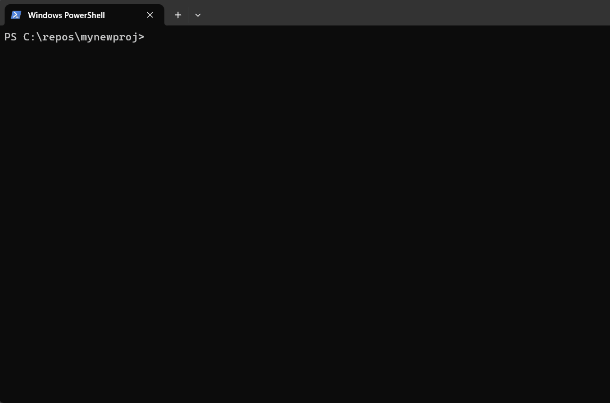
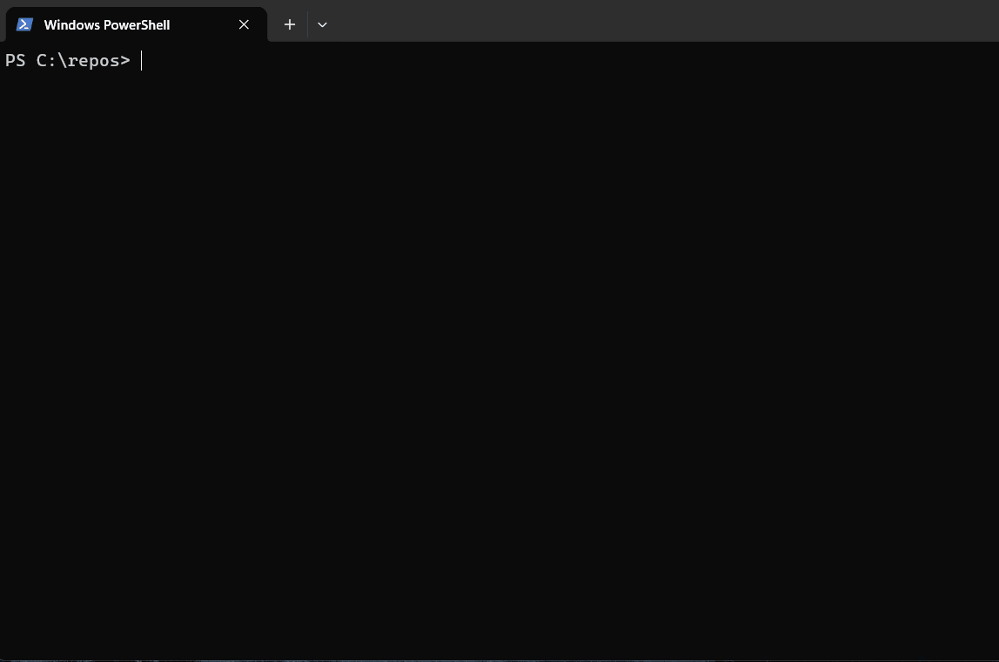

# nudge

Type the command you *meant*. An LLM figures it out; you confirm; it runs.
Use a cloud provider (recommended — best quality, no local install), or run a
local model when privacy or cost matters more. See
[Choosing a brain](#choosing-a-brain).

### 1. Tier 1 — typo fixed instantly, no model involved



`git pshu` fails, and `fix` proposes `git push` — labelled `(typo fix for
'git pshu')` so you can see no model was consulted. This is the sub-10 ms
path: the matcher is built from your own `PATH` and `git --help`, so it costs
nothing and works offline on any provider. Enter runs it and the push goes
through.

### 2. An unknown binary is caught automatically


Typing `printenv` — muscle memory from Linux — on Windows. Nothing is typed
after it: the shell's command-not-found hook fires nudge on its own, which
thinks for a moment and answers with the PowerShell equivalent,
`Get-ChildItem env:`. The hook only fires when the *binary* doesn't exist,
which is exactly this case.

### 3. A real binary, a wrong subcommand


`dotnet install dotnet-ef` — the binary exists, so no hook fires; it just
exits non-zero. Typing `fix` reads the failed command and its exit code from
history and proposes `dotnet tool install --global dotnet-ef`. This class of
mistake is the reason `fix` exists, and `dotnet-ef --version` afterwards
confirms the tool actually landed.

### 4. Destructive suggestions demand a typed `y`


Plain words rather than a command: `and uninstall dotnet-ef globally`. nudge
resolves it to `dotnet tool uninstall --global dotnet-ef`, then refuses to
accept a bare Enter — the model flagged the suggestion as destructive, so the
prompt changes to `[y = yes / Enter or n = no / e = edit]` and waits for an
explicit `y`. The same guard covers `rm -rf`, `git reset --hard`, force-push,
and `prune`.

### 5. Intent mode, including suggestions that change shell state



`just create dir mynewproj and init repo there` becomes
`mkdir mynewproj; cd mynewproj; git init`. Note the prompt afterwards: it is
now inside `mynewproj`. Because the suggestion runs through the shell wrapper
rather than a child process, the `cd` persists — the same reason `mkdir x && cd x` work.

## How it works

Bare `nudge` fixes the previous failed command when shell integration is
enabled. Give it words after `nudge` when you want help turning an intent into
a command. With shell integration enabled, entering an unknown command such as
`undo last commit` starts nudge automatically. You can also explicitly type
`nudge <your intent>` in any terminal.

It fixes two kinds of mistakes:

- **Fix mode** — you ran something that failed or doesn't exist:
  `git pshu` → `git push` · `docker remove image foo` → `docker rmi foo` ·
  `dotnet create migrations` → `dotnet ef migrations add <name>`
- **Intent mode** — you say what you want in plain words:
  `nudge undo last commit` → `git reset --soft HEAD~1` ·
  `nudge new migration AddOrders` → `dotnet ef migrations add AddOrders`
  (it saw your `.csproj`)

Pure typos (`git pshu`, `gti status`) are fixed **instantly without the model**
by a matcher built at runtime from your own `PATH` and your tools' own help
output. There are no pattern files or rules to maintain — anywhere.

## Install (5 minutes)

**1. Get the binary** — download the release for your platform and put it on
your `PATH`, or:

```powershell
# Windows (PowerShell)
irm https://raw.githubusercontent.com/eduardsjermaks/nudge/main/install.ps1 | iex
```
```bash
# Linux / macOS
curl -fsSL https://raw.githubusercontent.com/eduardsjermaks/nudge/main/install.sh | sh
```

The install scripts download binaries from the latest GitHub release. Building
from source: `go build ./cmd/nudge` — no CGO, no exotic deps.

**2. Run the wizard:**

```
nudge setup
```

It checks every piece and offers to fix what's missing: configures a cloud
provider — linking to the provider's key page and storing a pasted API key
privately in the config file — (or installs and starts Ollama and pulls the
model, if you prefer local), adds the shell integration, and finishes with
`nudge doctor`. Every
change asks for confirmation first, and it is safe to re-run any time: each
step detects "already done", so a re-run doubles as repair (and often
completes what a first run left pending). Re-running is also how you switch
providers — setup shows the current one and asks whether to keep it. If it
ends with "all good." you are done — the rest of this section is the manual
equivalent.

**3. Manual alternative: pick a model** — skip if the wizard did this. One
of the two, see [Choosing a brain](#choosing-a-brain) for the tradeoffs:

**3a. Cloud model** (recommended — best quality, no ~1 GB download or RAM
cost; needs an API key, queries leave your machine) — two steps: name the
provider in the config file, then put the API key in an environment variable.
Using Anthropic as the example:

*Create the config file.* nudge never creates it for you — the directory has
to exist. Locations differ per platform (`nudge doctor` prints the exact one):

```powershell
# Windows — %APPDATA%\nudge\config.toml
New-Item -ItemType Directory -Path "$env:APPDATA\nudge" -Force
Set-Content -Path "$env:APPDATA\nudge\config.toml" -Value 'provider = "anthropic"' -Encoding utf8
```
```bash
# Linux — ~/.config/nudge/config.toml (or $XDG_CONFIG_HOME/nudge/config.toml)
mkdir -p ~/.config/nudge
echo 'provider = "anthropic"' >> ~/.config/nudge/config.toml
```
```bash
# macOS — ~/Library/Application Support/nudge/config.toml
mkdir -p ~/Library/Application\ Support/nudge
echo 'provider = "anthropic"' >> ~/Library/Application\ Support/nudge/config.toml
```

*Set the API key.* Each provider reads its own standard variable —
`ANTHROPIC_API_KEY` here (`OPENAI_API_KEY`, `DEEPSEEK_API_KEY`,
`AZURE_OPENAI_API_KEY` for the others):

```powershell
# Windows (PowerShell) — persists for your user; reopen the shell afterwards
[Environment]::SetEnvironmentVariable('ANTHROPIC_API_KEY', 'sk-ant-...', 'User')
# current session only: $env:ANTHROPIC_API_KEY = 'sk-ant-...'
```
```bash
# Linux / macOS — add to ~/.bashrc or ~/.zshrc to persist
export ANTHROPIC_API_KEY='sk-ant-...'
```

Then run `nudge doctor` to confirm the key and endpoint work. OpenAI, Azure
OpenAI, and DeepSeek are configured the same way — see
[Per-provider setup](#per-provider-setup) for their config keys, and
[Credentials](#credentials) for alternatives to a plain environment variable.

**3b. Local model server** (private, free per query — nothing leaves your
machine) — [Ollama](https://ollama.com/download), no config file needed:

```
ollama pull qwen2.5-coder:1.5b
```

**4. Manual alternative: add the shell integration** — skip if the wizard
did this. Optional but recommended: it enables bare `nudge` / `fix` and the
automatic catch of misspelled binaries. Choose your shell below. Each setup
confirms that `nudge` is available, adds the generated integration, reloads
the shell configuration, and verifies `fix`.

### PATH setup

The installer tells you where it put the binary. If it also printed a note
that the directory is **not on your PATH**, `nudge` will not run until you fix
that — see the PATH setup for your platform below.

#### Linux / macOS

`install.sh` installs to `/usr/local/bin` when that is writable (already on
your PATH — nothing to do), and otherwise to `~/.local/bin`, which many
distributions do *not* have on `PATH` by default. If `nudge` comes back as
`command not found`, add that directory to your shell profile:

```bash
# bash
echo 'export PATH="$HOME/.local/bin:$PATH"' >> ~/.bashrc
. ~/.bashrc
```
```zsh
# zsh
echo 'export PATH="$HOME/.local/bin:$PATH"' >> ~/.zshrc
. ~/.zshrc
```
```fish
# fish
fish_add_path ~/.local/bin
```

Then verify:

```bash
command -v nudge
```

On Ubuntu and other Debian-based systems, `~/.profile` adds `~/.local/bin` to
`PATH` automatically — but only if the directory already existed when you
logged in. If the installer just created it, a full log out and back in also
works; the line above avoids the wait.

#### Windows

The PowerShell installer above adds its install directory to your user `PATH`
automatically. Open a new PowerShell session and verify the command is
available:

```powershell
Get-Command nudge
```

For a manually downloaded or locally built `nudge.exe`, copy it to a stable
user directory and add that directory to your user `PATH`:

```powershell
$nudgeBin = Join-Path $env:LOCALAPPDATA 'Programs\nudge'
New-Item -ItemType Directory -Path $nudgeBin -Force
Copy-Item .\nudge.exe -Destination $nudgeBin -Force

$userPath = [Environment]::GetEnvironmentVariable('Path', 'User')
if ($userPath -notlike "*$nudgeBin*") {
  [Environment]::SetEnvironmentVariable('Path', "$userPath;$nudgeBin", 'User')
}
```

Open a new PowerShell session after changing `PATH`, then run:

```powershell
Get-Command nudge
```


### PowerShell

1. Confirm that `nudge` is on your `PATH`:

   ```powershell
   Get-Command nudge
   ```

   Also make sure profile scripts are allowed to run — a fresh Windows
   install ships with execution policy `Restricted`, which makes every new
   session fail with "running scripts is disabled on this system" once a
   profile exists (`nudge setup` detects this and offers the same fix):

   ```powershell
   Set-ExecutionPolicy -Scope CurrentUser RemoteSigned
   ```

2. Create your PowerShell profile if it does not already exist. The
   `Test-Path` guard matters: `New-Item -Force` on its own **empties an
   existing profile**.

  ```powershell
  if (-not (Test-Path $PROFILE)) { New-Item -ItemType File -Path $PROFILE -Force }
  ```

3. Add this line to the profile:

  ```powershell
  Add-Content -Path $PROFILE -Value 'Invoke-Expression (& nudge init pwsh | Out-String)'
  ```

4. Reload the profile now, or open a new PowerShell session:

  ```powershell
  . $PROFILE
  ```

5. Verify that the `fix` alias is available:

  ```powershell
  Get-Command fix
  ```

After a command fails, type `fix` or bare `nudge` to suggest a correction.

### bash

1. Confirm that `nudge` is on your `PATH`:

  ```bash
  command -v nudge
  ```

2. Add the integration to `~/.bashrc`:

  ```bash
  echo 'eval "$(nudge init bash)"' >> ~/.bashrc
  ```

3. Reload the configuration:

  ```bash
  source ~/.bashrc
  ```

4. Verify the `fix` function:

  ```bash
  type fix
  ```

### zsh

1. Confirm that `nudge` is on your `PATH`:

  ```zsh
  command -v nudge
  ```

2. Add the integration to `~/.zshrc`:

  ```zsh
  echo 'eval "$(nudge init zsh)"' >> ~/.zshrc
  ```

3. Reload the configuration:

  ```zsh
  source ~/.zshrc
  ```

4. Verify the `fix` function:

  ```zsh
  type fix
  ```

### fish

1. Confirm that `nudge` is on your `PATH`:

  ```fish
  command -v nudge
  ```

2. Create the configuration directory if needed and add the integration:

  ```fish
  mkdir -p ~/.config/fish
  nudge init fish >> ~/.config/fish/config.fish
  ```

3. Reload the configuration:

  ```fish
  source ~/.config/fish/config.fish
  ```

4. Verify the `fix` function:

  ```fish
  type -q fix
  ```

Check the setup: `nudge doctor`.

### Honest numbers

| | |
|---|---|
| nudge binary | ~3 MB, <50 ms startup, <30 MB RSS |
| model on disk | ~1.0 GB (`qwen2.5-coder:1.5b`) |
| model in RAM | ~1.2 GB **inside the Ollama server** while loaded (`keep_alive`, default 10 m) |
| typo fixes (Tier 1) | < 10 ms, no model involved |
| model answers, modern laptop CPU | ~1–2 s warm |
| model answers, older 4-core ultrabook (2018, no GPU) | 5–8 s warm — usable, not snappy |
| first call after idle | + model load, roughly 2–5 s |

The memory belongs to the model server you installed, not to nudge — but you
pay it either way, so it's listed.

## Using it

**Level 1 — explicit (works everywhere, even cmd.exe):**

```
nudge git pshu                # fix a typo
nudge undo last commit        # describe what you want
nudge docker remove image alpine
```

With the shell integration installed, explicit invocations run through the
wrapper too, so suggestions that change shell state (`cd`, activating a
venv, `mkdir x && cd x && ...`) take effect in your shell. Without it,
nudge runs suggestions in a child process and prints shell-state ones for
you to run yourself.

**Level 2 — bare `nudge` / `fix` (needs the init line):** after a command
fails, just type `nudge` (or `fix`). The wrapper function reads your last
command and its exit code from shell history and proposes the correction.
This is the only way to catch mistakes like `dotnet create migrations`, where
the binary exists but the invocation is wrong.

**Level 3 — automatic (needs the init line):** mistype a *binary name*
(`gti status`) and the shell's command-not-found hook calls nudge for you.
Note honestly: these hooks only fire when the binary doesn't exist; a wrong
subcommand of a real tool returns exit ≠ 0 and no hook fires — that's what
`fix` is for.

At the prompt: **Enter** runs, **n** aborts, **e** edits the line first.
Destructive suggestions (`rm -rf`, `git reset --hard`, force-push, `prune`,
…) and low-confidence guesses never accept bare Enter — they demand a typed
`y` after a warning. Non-TTY output prints the suggestion and exits 3 without
running anything. The executed command's exit code is propagated.

`--explain` shows which tier answered, the provider and model, and how long
it took.

## Choosing a brain

Tier 1 (typo fixes) never involves a model. For everything else, pick one
provider — exactly one is active at a time, selected in the config:

- **Cloud (recommended):** best suggestion quality, no local install or RAM
  cost, needs an API key; **your queries leave your machine** and are subject
  to the provider's data policy. Supported: OpenAI, Azure OpenAI, Anthropic
  (Claude), DeepSeek.
- **Local:** private, free per query, ~1 GB model download, needs Ollama (or
  any OpenAI-compatible local server). Nothing leaves your machine — the
  right choice when privacy or per-query cost matters more than quality.
  This is the built-in default when no config file exists.

There is **no fallback between them**: if your chosen provider is down, nudge
degrades to Tier 1 — it never silently switches to a cloud key it happens to
find in your environment.

**Cost, honestly:** a suggestion is roughly 300–500 input + ~60 output
tokens. On the cheap tiers (gpt-5-mini, deepseek-chat, claude-haiku) that is
fractions of a cent per correction — and Tier-1 fixes cost nothing.

### Per-provider setup

**OpenAI** (default model `gpt-5-mini`) — create a key at
<https://platform.openai.com/api-keys>:

```toml
provider = "openai"          # key from OPENAI_API_KEY
```

**Anthropic** (default model `claude-haiku-4-5`) — create a key at
<https://console.anthropic.com/settings/keys>:

```toml
provider = "anthropic"       # key from ANTHROPIC_API_KEY
```

**DeepSeek** (default model `deepseek-chat`) — create a key at
<https://platform.deepseek.com/api_keys>:

```toml
provider = "deepseek"        # key from DEEPSEEK_API_KEY
```

**Azure OpenAI** (no default possible — "model" is your deployment) — the
key is under your Azure OpenAI resource's "Keys and Endpoint" blade in the
[Azure portal](https://portal.azure.com):

```toml
provider = "azure"           # key from AZURE_OPENAI_API_KEY
azure_endpoint = "https://myresource.openai.azure.com"
azure_deployment = "my-deploy"
# azure_api_version = "2024-10-21"   # the default
```

**Custom** — anything OpenAI-compatible, local or not: LM Studio, llama.cpp
server, vLLM, a gateway:

```toml
provider = "custom"
endpoint = "http://localhost:1234"   # LM Studio default
model    = "loaded-model-name"
# key (optional) from NUDGE_API_KEY
```

After switching, run `nudge doctor` — it validates the key, the endpoint,
and JSON output for the *active* provider, and measures warm latency.

### Credentials

Resolved in this order: the provider's standard env var
(`OPENAI_API_KEY`, `AZURE_OPENAI_API_KEY`, `ANTHROPIC_API_KEY`,
`DEEPSEEK_API_KEY`, `NUDGE_API_KEY` for custom) → `api_key_env = "SOME_VAR"`
in the config → `api_key` in the config file. The last is where
`nudge setup` stores a pasted key; nudge tightens the file to 0600 on
Linux/macOS, and the env var — if you set it later — always wins. Keys never
appear in logs, errors, `--explain` output, or the doctor report (it shows
only "present, ends …xxxx").

## Configuration (infrastructure only — there is no matching config)

`%APPDATA%\nudge\config.toml` on Windows,
`~/Library/Application Support/nudge/config.toml` on macOS, and
`$XDG_CONFIG_HOME/nudge/config.toml` (default `~/.config/nudge/config.toml`)
elsewhere. `nudge doctor` prints the path it actually uses. Env vars in
parentheses override the file:

```toml
provider   = "ollama"                    # (NUDGE_PROVIDER) ollama | openai | azure | anthropic | deepseek | custom
endpoint   = "http://localhost:11434"   # (NUDGE_ENDPOINT) ollama/custom only; must be loopback
model      = "qwen2.5-coder:1.5b"       # (NUDGE_MODEL) optional override of the provider default
keep_alive = "10m"                       # (NUDGE_KEEP_ALIVE) how long the local model stays warm
timeout    = 30                          # (NUDGE_TIMEOUT) seconds, local providers
timeout_ms = 8000                        # (NUDGE_TIMEOUT_MS) overrides timeout; cloud default is 8000
confidence = 0.6                         # (NUDGE_CONFIDENCE) below this = "best guess" label
# api_key_env = "SOME_VAR"               # indirection: read the key from this env var
# api_key = "..."                        # key in the file — `nudge setup` stores pasted keys here, see Credentials
# allow_non_local = true                 # (NUDGE_ALLOW_NON_LOCAL) ollama/custom on another machine
```

**Better local quality:** `model = "qwen2.5-coder:3b"` (~2 GB) is noticeably
smarter and the recommended upgrade if your machine keeps up.

**Degraded mode:** if the active provider is unreachable, typo fixes
(Tier 1) keep working and model queries fail with a one-line hint to run
`nudge doctor`. This never triggers a switch to another provider.

## Privacy

What leaves your machine depends entirely on which provider *you* configured:

| Provider | What is sent | When |
|---|---|---|
| ollama (default), custom on localhost | nothing leaves the machine | — |
| openai / azure / anthropic / deepseek | the Tier-2 query (below), secrets masked | only when Tier 1 has no answer |
| custom with `allow_non_local` | the Tier-2 query, unmasked | only when Tier 1 has no answer |

- **With the local default, nothing leaves your machine.** nudge talks only
  to a loopback address and hard-fails on any non-local endpoint unless you
  explicitly set `allow_non_local = true`. There is no telemetry, no
  analytics, no update check, and **no cloud fallback**: an API key sitting
  in your environment is never used unless you selected that provider.
- **A Tier-2 query is, exactly:** your typed command (or intent text), its
  exit code, your OS and shell name, and the *names* of project marker files
  in the current directory (`Api.csproj`, `package.json`, …). **Never file
  contents**, never environment variables, never directory listings beyond
  those marker names. With a cloud provider this goes to that provider and
  is subject to its data policy.
- **Secret masking (cloud only):** before sending, nudge scans the input for
  likely secrets — known key prefixes (`sk-…`, `ghp_…`, `AKIA…`, JWTs, …),
  `Authorization: Bearer` values, password-looking `-p`/`--password`
  arguments, and long high-entropy tokens. Each is replaced with a stable
  placeholder (`«SECRET_1»`) before the request, and restored verbatim in
  the returned command. Heuristic, not a guarantee — don't paste secrets
  you can't afford to leak.
- Tier 1 reads executable names from `PATH` and runs `tool --help` for a known
  set of CLIs to learn their subcommands; results are cached locally in your
  user cache directory. Tier 1 never makes a network call, on any provider.

## Uninstall

Three steps everywhere: remove the shell-integration line, delete the binary
(and the PATH entry the installer added), delete config + cache. Run the
block for your platform, then open a new terminal.

```powershell
# Windows (PowerShell)
(Get-Content $PROFILE) | Where-Object { $_ -notmatch 'nudge init' } | Set-Content $PROFILE
$dest = "$env:LOCALAPPDATA\Programs\nudge"
Remove-Item -Recurse -Force $dest
$p = [Environment]::GetEnvironmentVariable('Path', 'User')
[Environment]::SetEnvironmentVariable('Path', (($p -split ';' | Where-Object { $_ -and $_ -ne $dest }) -join ';'), 'User')
Remove-Item -Recurse -Force "$env:APPDATA\nudge", "$env:LOCALAPPDATA\nudge" -ErrorAction SilentlyContinue
```

```bash
# Linux — rc file: ~/.bashrc here; ~/.zshrc, ~/.profile, or
# ~/.config/fish/config.fish if that is where you added the init line
sed -i '/nudge init/d' ~/.bashrc
rm -f ~/.local/bin/nudge /usr/local/bin/nudge
rm -rf ~/.config/nudge ~/.cache/nudge
```

```bash
# macOS — same rc-file note as Linux; BSD sed needs -i ''
sed -i '' '/nudge init/d' ~/.zshrc
rm -f ~/.local/bin/nudge /usr/local/bin/nudge
rm -rf ~/Library/Application\ Support/nudge ~/Library/Caches/nudge
```

If the installer told you to add `~/.local/bin` to your PATH, that line is
safe to keep — many other tools install there too.

If you installed Ollama only for nudge, remove the model and the app:

```
ollama rm qwen2.5-coder:1.5b
```

then `winget uninstall Ollama.Ollama` (Windows), `brew uninstall ollama`
(macOS/Homebrew), or Ollama's own
[uninstall steps](https://github.com/ollama/ollama/blob/main/docs/linux.md#uninstall)
(Linux). Downloaded models live in `~/.ollama` — delete that too if you want
the disk space back.

## Development

```
go test ./...                      # unit tests, no model needed
NUDGE_EVAL=1 go test ./eval -v     # model eval (needs a local model)
make build-all                     # cross-compile windows/linux/darwin × amd64/arm64
```

On Windows, `make` is optional. The repo includes a PowerShell equivalent:

```powershell
.\build-release.ps1 -Version v0.1.0
```

## Releases

Pushing a version tag automatically tests, cross-compiles all supported targets,
creates a GitHub Release, and uploads the installer assets. The generated
`dist/` directory deliberately stays out of Git.

1. Pick a version, for example `v0.1.0`.
2. Commit and push the changes you want to release.
3. Create and push the tag: `git tag v0.1.0` and `git push origin v0.1.0`
4. Watch the **Release** workflow in the repository's Actions tab. When it
  succeeds, the release and its six binary assets are published automatically.

The workflow runs `go test ./...` before publishing. If the test or build step
fails, no release is created. After a successful release, the install scripts
resolve `releases/latest/download/...` automatically.

For a local build without publishing, install Go from https://go.dev/dl/ and
run `make build-all VERSION=v0.1.0` on Unix-like systems or
`.\build-release.ps1 -Version v0.1.0` in PowerShell.

See `DESIGN.md` for the two-tier architecture, the no-configuration
principle, safety validation, and shell-integration tradeoffs. Scoop and
Homebrew packaging are future work.

## License

MIT — see [LICENSE](LICENSE).
